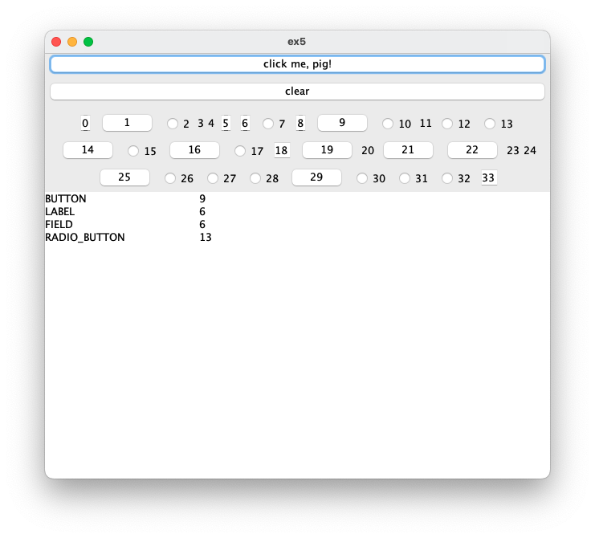

# Лабораторная работа №5

## Задание: 
 ## Разработать программу, добавляющую на форму последовательность элементов управления случайной длины.Тип элементов управления задается случайным образом.Предусмотреть возможность вывода информации о количестве элементов по типам.
 
Окно:
